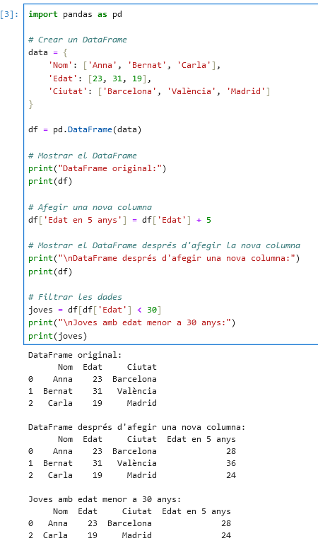

[](https://classroom.github.com/a/ULiw8LbN)
# Not Empty
Exercici 1:
tail -f /etc/mp/fitxer.log Per analitzar els logs de un fitxer.log. 
grep "paraula_a_cercar" /etc/mp/fitxer.log Per trobar la paraula encronquet dintre del fitxer log.


El concepte logging és molt important en la programació, alhora que està estrictament
relacionat amb el tema que estem treballant. Un log en el nostre àmbit vindria a ser
un fitxer que conté dades relacionades amb els principals esdeveniments i successos
que ocorren en un programa o en un sistema operatiu, així doncs, ja sigui per saber
en quin punt hem tingut un error, perquè l&#39;execució del programa no ha anat bé, o
quina sèrie de passes ha seguit una persona mentre utilitzava la nostra aplicació i
moltes altres utilitats, els Logs són vitals al món del software.


Exercici 2 part 2:
Que creieu que és millor mostrar els logs per exemple a la terminal durant l'execució del programa o bolcar-los en un fitxer de text? 
Afegiu al readme.md del repositori aquesta pregunta amb la seva reposta 

És molt més millor i practic revisar els logs bolcats en fitxer de text perqué d'aquesta forma és molt més fàcil de poder debuggear
ja que en un escenari real amb un programa certament complex el terminal pot esta "spamejad" per logs i errors i no seria gaira fàcil de llegir 
i entendre el que esta passant.

Exercici 2 part 3:
## Comparació de Maneres de Fer Logs

| **Mètode**                                           | **Exemple**                                                                                                                                   | **Avantatges**                                                                                       | **Desavantatges**                                                                                     |
|------------------------------------------------------|-----------------------------------------------------------------------------------------------------------------------------------------------|------------------------------------------------------------------------------------------------------|--------------------------------------------------------------------------------------------------------|
| **Configuració per defecte del mòdul `logging`**     | ```python<br>import logging<br>logging.basicConfig(level=logging.INFO)<br>logging.info("Missatge informatiu")<br>```                          | - Fàcil d'implementar<br>- Ideal per a projectes petits<br>- No cal configurar explícitament *handlers* ni *formatters*. | - Limitat en funcionalitat<br>- Difícil d'adaptar en aplicacions grans<br>- No suporta configuracions avançades. |
| **Instanciar un objecte logger i parametritzar-lo**  | ```python<br>logger = logging.getLogger("app_logger")<br>handler = logging.FileHandler("app.log")<br>logger.addHandler(handler)<br>```        | - Alta flexibilitat<br>- Suporta múltiples *handlers* i configuracions avançades.<br>- Pot separar el *logging* per mòduls. | - Necessita més codi per a configuració inicial<br>- Pot ser confús si no està ben documentat.          |
| **Instanciar un logger des d’un fitxer de configuració** | - Fitxer de configuració (JSON):<br>`{"version":1,"handlers":{"file":{"class":"logging.FileHandler","filename":"app.log"}}}`<br>- Programa:<br>`logging.config.dictConfig(config)` | - Centralitza configuracions complexes<br>- Pot ser fàcilment modificable sense tocar el codi<br>- Ideal per a grans aplicacions. | - Afegir fitxers externs pot complicar la distribució<br>- No és intuïtiu si no es coneixen els formats. |


Exercici 2 part 4:

## Comparació de Llibreries de Logging en Altres Llenguatges

| **Característica**                 | **Llenguatge: Java**                      | **Llenguatge: JavaScript**               |
|------------------------------------|-------------------------------------------|------------------------------------------|
| **Nom de la llibreria**            | Log4j                                     | Winston                                  |
| **És nativa del llenguatge?**      | No (cal instal·lar-la com a llibreria externa). | No (cal instal·lar-la via npm).          |
| **URL per descarregar-se la llibreria** | [Log4j](https://logging.apache.org/log4j/) | [Winston](https://github.com/winstonjs/winston) |
| **Inicialització de l’objecte de logger** | ```java<br>import org.apache.logging.log4j.LogManager;<br>import org.apache.logging.log4j.Logger;<br>private static final Logger logger = LogManager.getLogger(NomDeLaClasse.class);<br>``` | ```javascript<br>const winston = require('winston');<br>const logger = winston.createLogger({<br>level: 'info',<br>format: winston.format.json(),<br>transports: [<br>new winston.transports.Console(),<br>new winston.transports.File({ filename: 'app.log' })<br>]<br>});<br>``` |
| **Nivells de log disponibles**     | TRACE, DEBUG, INFO, WARN, ERROR, FATAL.   | error, warn, info, http, verbose, debug, silly. |
| **Mètode per fer log**             | ```java<br>logger.info("Missatge informatiu");<br>logger.error("Missatge d'error");``` | ```javascript<br>logger.info("Missatge informatiu");<br>logger.error("Missatge d'error");``` |
| **Tipus de manegadors (pantalla, fitxer…)** | - ConsoleAppender (pantalla).<br>- FileAppender (fitxer).<br>- RollingFileAppender (fitxers amb rotació).<br>- AsyncAppender (asíncron). | - Console (pantalla).<br>- File (fitxer).<br>- HTTP (envia logs via HTTP). |
| **Opcions de format**              | Definides en un fitxer de configuració (XML, JSON, YAML). Exemple:<br>```xml<br><PatternLayout pattern="%d{yyyy-MM-dd HH:mm:ss} [%t] %-5level %logger{36} - %msg%n"/><br>``` | Definides en la configuració de Winston. Exemple:<br>```javascript<br>winston.format.printf(({ level, message, timestamp }) => {<br>return `${timestamp} ${level}: ${message}`;<br>});<br>``` |


Exercici 3:

ReportLab:


